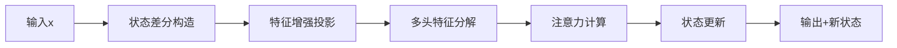
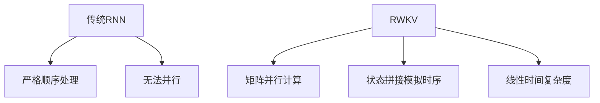
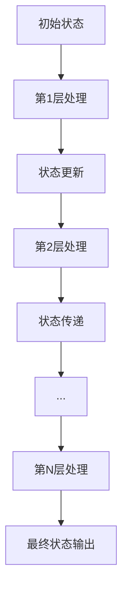

# RWKV7 结构解析

## 1. 整体架构

RWKV7是一个线性注意力模型，通过创新的时间混合机制(Time-mix)实现了O(n)的计算复杂度。其核心组件包括：

- 嵌入层 (Embedding)
- 多层Block (包含Time-mix和Channel-mix)
- 输出层 (LayerNorm + Linear)

### 1.1 基本参数
- HEAD_SIZE: 每个注意力头的维度
- n_layer: 模型层数
- n_embd: 嵌入维度
- vocab_size: 词表大小

## 2. 核心机制：Time-mix (RWKV_Tmix_x070)

### 2.1 四个关键张量
- r (receptance): 门控机制，控制新信息接收程度
- w (decay): 衰减因子，控制历史信息的衰减速度
- k (key): 特征提取器，提取当前输入的关键特征
- v (value): 信息载体，存储实际内容

### 2.2 计算流程
1. 时间偏移处理：
```python
xx = self.time_shift(x) - x
xr = x + xx * self.x_r  # 计算receptance输入
xw = x + xx * self.x_w  # 计算decay输入
xk = x + xx * self.x_k  # 计算key输入
xv = x + xx * self.x_v  # 计算value输入
```

2. 特征提取：
- receptance通过线性层计算门控值
- decay通过可训练参数计算衰减系数
- key和value通过线性层提取特征

3. 信息融合：
- 使用CUDA核优化的线性注意力计算
- 通过衰减机制维护长期依赖
- 使用门控机制控制信息流动

## 3. 数据流转说明

### 3.1 形状变化
输入序列 [B,T] → 嵌入层 [B,T,C] → Block处理 [B,T,C] → 输出 [B,T,vocab_size]
其中：
- B: 批次大小
- T: 序列长度
- C: 嵌入维度

### 3.2 并行计算
- 所有时间步可并行计算
- 通过CUDA核优化批次处理
- 支持动态序列长度

### 3.3 各层形状变化流程（以T=128为例）

### 输入输出维度变化表
| 层级                | 输入形状          | 输出形状          | 说明                  |
|---------------------|------------------|------------------|-----------------------|
| 嵌入层 (emb)        | [B, T=128]       | [B, 128, C]      | C=嵌入维度            |
| Block中的Time-mix   | [B, 128, C]      | [B, 128, C]      | 保持维度，特征重组     |
| Block中的Channel-mix| [B, 128, C]      | [B, 128, C]      | 通道维度特征变换       |
| LayerNorm (ln_out)  | [B, 128, C]      | [B, 128, C]      | 数值稳定化处理         |
| 输出头 (head)       | [B, 128, C]      | [B, 128, vocab]  | 生成词表概率分布       |

### 详细处理流程
```python
# 输入示例 (B=1)
x = torch.tensor([[1,2,3,...,128]])  # shape [1, 128]

# 嵌入层处理
x = self.emb(x)  # [1,128] => [1,128,C]

# Block内部处理 (以单层为例)
for block in self.blocks:
    # Time-mix处理
    x_attn = block.att(block.ln1(x))  # [1,128,C] => [1,128,C]
    x = x + x_attn                    # 残差连接保持形状
    
    # Channel-mix处理 
    x_ffn = block.ffn(block.ln2(x))   # [1,128,C] => [1,128,C]
    x = x + x_ffn                     # 残差连接保持形状


# 最终输出
x = self.ln_out(x)        # [1,128,C]
logits = self.head(x)     # [1,128,vocab_size]
```

### 关键维度特性
1. **时间维度T恒定**：全程保持128时间步
2. **通道维度C转换**：
   - 嵌入层将token索引映射为C维向量
   - 各Block内部进行C维特征重组
3. **批处理维度B传递**：所有层保持批次维度不变

### 3.4 具体数据流动示例

以下展示一个实际的数据流动示例：
- 批次大小：B=3
- 嵌入维度：C=2560
- 词表大小：vocab_size=65536
- 序列长度：T=128

#### 3.4.1 输入数据示例
```python
# 输入形状：[B=3, T=128]
x = torch.tensor([
    [    23,  1025,   ....,    45],  # 第1个序列
    [  8721,   127,   ....,  5932],  # 第2个序列
    [    42, 62301,   ...,   891]   # 第3个序列
], dtype=torch.long)  # 每个数字范围：0~65535
```

#### 3.4.2 嵌入层变换
```python
# 输入 [3, 128] → 输出 [3, 128, 2560]
x = self.emb(x)
# 结果示意：
x = torch.tensor([
    [[-0.12, 0.05, ..., 0.31],  # 序列1-token1的2560维向量
     [ 0.42, 0.11, ..., 0.08],  # 序列1-token2的2560维向量
     ...],
    [[ 0.31, 0.92, ..., 0.22],  # 序列2-token1的2560维向量
     [-0.15, 0.45, ..., 0.67],  # 序列2-token2的2560维向量
     ...],
    ...
], dtype=torch.float)
```

#### 3.4.3 Block层处理
```python
# Time-mix (RWKV_Tmix_x070)
x_attn = block.att(block.ln1(x))  # [3, 128, 2560] → [3, 128, 2560]
# 内部计算：
r = self.receptance(xr)  # 门控信号，范围通常在[0,1]
w = -F.softplus(-(self.w0 + torch.tanh(xw @ self.w1) @ self.w2)) - 0.5  # [3,32,2560]
k = self.key(xk)         # 特征提取
v = self.value(xv)       # 信息内容

# Channel-mix (RWKV_CMix_x070)
x_ffn = block.ffn(block.ln2(x))  # [3, 128, 2560] → [3, 128, 2560]
```

#### 3.4.4 输出层变换
```python
# 最终输出 [3, 128, 2560] → [3, 128, 65536]
logits = self.head(self.ln_out(x))
# 结果示意：
logits = torch.tensor([
    [[ 0.01, -0.5, ..., 0.02],  # 序列1-位置1的词表概率分布
     [-0.12,  0.8, ..., 0.03],  # 序列1-位置2的词表概率分布
     ...],
    ...
])

# 每个位置输出65536个logits，表示下一个token的概率分布
probs = F.softmax(logits, dim=-1)  # 转换为概率
```

#### 3.4.5 数据流关键特点
1. **批次并行**：
   - 3个序列在所有运算中并行处理
   - 每个序列保持独立的特征表示

2. **维度变化**：
   - 输入：每个token是0~65535的整数
   - 嵌入：将整数映射为2560维向量
   - Block：在2560维空间中进行特征变换
   - 输出：将2560维特征映射回65536维概率分布

3. **数值范围**：
   - 嵌入向量：通常在[-1, 1]范围
   - 中间特征：经过LayerNorm标准化
   - 最终logits：未归一化的分数
   - 概率分布：softmax后在[0, 1]范围

### 3.5 每个层具体变化

在 RWKV7 模型中，每一层都对数据进行特定的处理和转换，从而实现从原始 token 到最终预测的完整流程。下面我们详细说明每个层的具体变化：

#### 1. 嵌入层 (Embedding)
- **输入**：形状为 [B, T] 的整数 token 序列（例如，每个 token 的取值范围为 0 到 65535）。
- **操作**：查找并映射到词嵌入矩阵，词嵌入矩阵尺寸为 [vocab_size, C]（例如 vocab_size = 65536，C = 2560）。
- **输出**：输出张量形状为 [B, T, C]，每个 token 被表示为一个 C 维向量。

#### 2. Block 层（包含 Time-mix 和 Channel-mix）
每个 Block 都由两个主要模块构成，并通过残差连接将处理结果累加回输入，其输入和输出形状均保持为 [B, T, C]。

##### (a) Time-mix 部分
- **输入**：形状为 [B, T, C] 的当前 Block 输入。
- **主要操作**：
  1. **时间位移**  
     - 对输入执行时间位移操作：利用 `self.time_shift(x)` 得到当前时刻与前一时刻之间的差异信息。  
     - 计算 `xx = self.time_shift(x) - x` 捕获局部时间变化。  
  2. **混合系数加权**  
     - 使用一组可训练的混合系数（如 `x_r`, `x_w`, `x_k`, `x_v`）将原始输入和时间差异进行加权组合，产生多个分支：  
       - `xr = x + xx * self.x_r`（用于生成门控输入 r）  
       - `xw = x + xx * self.x_w`（用于衰减分支）  
       - `xk = x + xx * self.x_k`（用于生成关键特征 k）  
       - `xv = x + xx * self.x_v`（用于生成信息内容 v）  
  
  3. **线性转换与激活**  
     - 对各分支分别执行线性变换，计算出：  
       - 门控信号 r：通常通过 `sigmoid(linear(xr))` 限制在 [0, 1] 范围内。  
       - 特征 k 与信息 v：通过对应的线性层提取。  
     - 同时，利用衰减因子（例如通过计算 softplus 后取负值，或其他特定操作）来调节跨时间步的信息流失。
  4. **融合输出**  
     - 结合 r、k、v 及衰减信息，通过专门的 CUDA 核进行高效的线性注意力计算，生成 Time-mix 模块的输出。
- **输出**：结果形状仍为 [B, T, C]，随后与原输入通过残差连接相加。

##### (b) Channel-mix 部分
- **输入**：经过 Time-mix 处理（并残差更新后的）张量，形状为 [B, T, C]。
- **主要操作**：
  1. **时间位移与特征混合**  
     - 同样执行与 Time-mix 类似的时间位移对齐操作，利用另一组专门为 Channel-mix 设计的混合系数。  
  2. **非线性转换与门控**  
     - 对调整后的数据进行线性变换，提取新的特征向量。  
     - 引入门控机制（例如经过 `sigmoid` 激活的门控）来控制信息的流入与流出。  
  3. **残差更新**  
     - 将 Channel-mix 模块的输出也通过残差连接加入原始输入，确保数据通路不会受过度变换影响。
- **输出**：保持形状为 [B, T, C]。

#### 3. 层归一化 (LayerNorm)
- **输入**：经过多个 Block 处理后得到的张量，形状为 [B, T, C]。
- **操作**：利用 LayerNorm 对每个样本、每个时间步的特征进行归一化，调整均值和方差，提升模型稳定性。
- **输出**：归一化后张量依然保持 [B, T, C] 的形状。

#### 4. 输出头 (Head)
- **输入**：归一化后的特征张量 [B, T, C]。
- **操作**：通过一个线性映射层将 C 维特征投影到词表维度，即将每个时间步的特征转换为 logits 向量，用于计算 softmax 概率。
- **输出**：最终输出形状为 [B, T, vocab_size]（例如 [3, 128, 65536]），代表每个时间步上各 token 的预测分布。

---

**流水线总结：**

1. **嵌入层**  
   输入 [B, T] → 嵌入映射 → 输出 [B, T, C]

2. **每个 Block 内部**  
   - **Time-mix**：  
     通过时间位移、混合系数加权、线性转换和线性注意力计算，产生 [B, T, C] 输出  
     （内部包含参数 r（门控）、w（衰减）、k（关键）和 v（信息））
   - **Channel-mix**：  
     通过相似的时间位移和混合机制，再经过门控和线性变换，输出 [B, T, C]  
   - 两者通过残差连接叠加，保证信息不丢失

3. **层归一化**  
   对 Block 输出特征进行归一化，保持 [B, T, C] 的稳定分布

4. **输出头**  
   将归一化后的特征映射到词表维度，输出 logits [B, T, vocab_size]


### 3.6 WindBackstepping函数的详细解析

#### 代码结构解析
```python
class WindBackstepping(torch.autograd.Function):
    @staticmethod
    def forward(ctx, w,q,k,v,z,b):
        B,T,H,C = w.shape 
        assert T%CHUNK_LEN == 0  # 确保序列长度是分块长度的整数倍
        assert all(i.dtype==torch.bfloat16 for i in [w,q,k,v,z,b])  # 强制bfloat16精度
        assert all(i.is_contiguous() for i in [w,q,k,v,z,b])  # 内存连续布局
        
        y = torch.empty_like(v)  # 输出张量预分配
        s = torch.empty(B,H,T//CHUNK_LEN,C,C, dtype=torch.float32,device=w.device)  # 跨chunk状态缓存
        sa = torch.empty(B,T,H,C, dtype=torch.float32,device=w.device)  # 注意力状态缓存
        
        torch.ops.wind_backstepping.forward(w,q,k,v,z,b, y,s,sa)  # 调用CUDA核
        
        ctx.save_for_backward(w,q,k,v,z,b,s,sa)  # 保存反向传播所需张量
        return y

    @staticmethod
    def backward(ctx, dy):
        w,q,k,v,z,b,s,sa = ctx.saved_tensors  # 获取前向传播缓存
        
        # 为各参数预分配梯度张量
        dw,dq,dk,dv,dz,db = [torch.empty_like(x) for x in [w,q,k,v,z,b]]  
        
        # 调用反向传播CUDA核
        torch.ops.wind_backstepping.backward(w,q,k,v,z,b, dy,s,sa, dw,dq,dk,dv,dz,db)
        
        return dw,dq,dk,dv,dz,db
```

#### 前向传播实现细节
1. **输入验证阶段**：
   - `B,T,H,C = w.shape`：解包张量维度，B=批次, T=序列长度, H=头数, C=特征维度
   - `T%CHUNK_LEN == 0`：强制序列长度必须是分块长度(16)的整数倍
   - `bfloat16`检查：确保所有输入张量使用半精度存储以节省显存

2. **内存预分配**：
   - `y = torch.empty_like(v)`：输出张量与v同形状([B,T,H,C])
   - `s`缓存：形状[B,H,T//16,C,C]，每个chunk存储C×C的状态矩阵
   - `sa`缓存：形状[B,T,H,C]，保存每个时间步的注意力状态

3. **CUDA核调用**：
   - 参数顺序：输入张量在前，输出/缓存张量在后
   - 内存布局：所有张量通过contiguous()保证内存连续

#### 反向传播实现细节
1. **梯度张量分配**：
   - `[torch.empty_like(x) for x in [w,q,k,v,z,b]]`：为每个参数创建对应形状的梯度容器
   - 保持bfloat16精度：梯度类型与原始参数类型一致

2. **CUDA核参数**：
   - 前向传播参数：w,q,k,v,z,b
   - 梯度输入：dy (来自上层的梯度)
   - 状态缓存：s, sa
   - 梯度输出：dw,dq,dk,dv,dz,db

3. **原子操作保证**：
   - 多线程写入：不同CUDA线程可能更新同一梯度位置，使用原子操作避免竞争
   - 梯度累加：对dw等参数的更新采用+=模式

#### 关键设计特性
1. **分块计算优化**：
   - 每16个时间步为一个chunk (CHUNK_LEN=16)
   - 局部注意力计算在chunk内部完成
   - 跨chunk信息通过s缓存传递

2. **混合精度策略**：
   - 计算用float32：s/sa缓存使用float32保证数值稳定性
   - 存储用bfloat16：输入/输出张量使用bfloat16节省显存

3. **内存访问优化**：
   - 寄存器缓存：CUDA核中将64维特征(HEAD_SIZE)保留在寄存器
   - 合并内存访问：强制张量连续布局，提高全局内存访问效率


### 3.7 WindBackstepping函数与RWKV_Tmix_x070的迷人结合
让我们通过一个具体的例子来理解WindBackstepping与RWKV_Tmix_x070的数据流转过程。

假设我们有以下输入:
- batch_size = 3 (处理3个序列)
- vocab_size = 65536 (词表大小0~65535)
- n_embd = 2560 (嵌入维度)
- head_size = 64 (每个注意力头的维度)
- n_head = 40 (注意力头数量 = 2560/64)
- seq_len = 32 (序列长度,需要是16的倍数)

#### 数据流转示例

1. **输入阶段**
   - 输入 token_ids 形状为 [3,32]（3个序列，每个长度32）
   - 经过嵌入层转换为形状 [3,32,2560] 的特征张量

2. **Time-mix 处理阶段**
   - **时间位移**：对输入执行 `xx = time_shift(x) - x`，得到时间差异特征
   - **混合系数加权**：
     - xr = x + xx * x_r → 形状保持 [3,32,2560]
     - xw = x + xx * x_w → 用于生成衰减参数
     - xk = x + xx * x_k → 关键特征提取
     - xv = x + xx * x_v → 信息内容生成

3. **参数计算**：
   - 门控信号 r = receptance(xr) → [3,32,2560]
   - 衰减参数 w = -F.softplus(-(self.w0 + torch.tanh(xw @ self.w1) @ self.w2)) - 0.5 → [3,32,2560]
   - 关键特征 k = key(xk) → [3,32,2560]
   - 信息内容 v = value(xv) → [3,32,2560]

4. **WindBackstepping 调用**：
   - 将 r,w,k,v 重塑为 [3,32,40,64]（40头×64维）
   - 调用 `RUN_CUDA_RWKV7g` 触发 CUDA 核计算：
     - 分块处理：将32时间步分为2个chunk（32/16=2）
     - 每个chunk内部进行局部注意力计算
     - 跨chunk信息通过s缓存传递（形状 [3,40,2,64,64]）

5. **输出整合**：
   - CUDA核输出形状 [3,32,40,64]
   - 重塑回 [3,32,2560]
   - 层归一化处理保持数值稳定
   - 最终输出形状 [3,32,2560] 传递到下一层

```python
def forward(self, x):
    B, T, C = x.shape  # 输入形状 [3,32,2560]
    xx = self.time_shift(x) - x  # 时间差异 [3,32,2560]
    
    # 混合系数加权
    xr = x + xx * self.x_r  # [3,32,2560]
    xw = x + xx * self.x_w  # [3,32,2560]
    xk = x + xx * self.x_k  # [3,32,2560]
    xv = x + xx * self.x_v  # [3,32,2560]
    
    # 参数计算
    r = self.receptance(xr)  # [3,32,2560]
    w = -F.softplus(-(self.w0 + torch.tanh(xw @ self.w1) @ self.w2)) - 0.5  # [3,32,2560]
    k = self.key(xk)         # [3,32,2560] 
    v = self.value(xv)       # [3,32,2560]
    
    # 多头重塑
    r = r.view(B,T,self.n_head,self.head_size)  # [3,32,40,64]
    w = w.view(B,T,self.n_head,self.head_size)  # [3,32,40,64]
    k = k.view(B,T,self.n_head,self.head_size)  # [3,32,40,64]
    v = v.view(B,T,self.n_head,self.head_size)  # [3,32,40,64]
    
    # 调用CUDA核
    x = RUN_CUDA_RWKV7g(r, w, k, v, -kk, kk*a)
    x = x.view(B,T,C)  # 保持形状 [3,32,2560]
    return self.ln_out(x)  # 输出形状 [3,32,2560]
```

### 形状变化流程表
| 处理步骤               | 输入形状       | 输出形状       | 说明                  |
|------------------------|----------------|----------------|-----------------------|
| 初始输入               | [3,32,2560]    | [3,32,2560]    | 嵌入层输出            |
| 时间位移处理           | [3,32,2560]    | [3,32,2560]    | 计算时间差异          |
| 混合系数加权           | [3,32,2560]    | [3,32,2560]    | 各通道独立加权        |
| 参数计算(r/w/k/v)      | [3,32,2560]    | [3,32,2560]    | 线性变换+激活         |
| 多头重塑               | [3,32,2560]    | [3,32,40,64]   | 拆分为多头注意力      |
| CUDA核计算             | [3,32,40,64]   | [3,32,40,64]   | 分块并行计算          |
| 输出重塑               | [3,32,40,64]   | [3,32,2560]    | 合并多头输出          |
| 层归一化               | [3,32,2560]    | [3,32,2560]    | 稳定数值分布          |

在RWKV7中,多头注意力的拆分机制如下:

1. **维度拆分**:
   - 输入特征维度为2560 (n_embd)
   - 每个头大小为64 (head_size)
   - 总共40个头 (n_head = 2560/64)

2. **重塑过程**:
   - 输入张量形状: [batch, seq_len, n_embd]
   - 重塑为: [batch, seq_len, n_head, head_size]
   - 例如: [3,32,2560] -> [3,32,40,64]

3. **并行计算**:
   - 每个头独立计算注意力
   - 所有头共享相同的时间混合参数
   - CUDA核同时处理所有头

4. **信息交互**:
   - 头内: 通过局部chunk计算
   - 头间: 完全独立,无交互
   - 最后通过输出层融合

5. **优势**:
   - 并行度高,计算效率好
   - 每个头可以关注不同特征
   - 结构简单,易于优化

示意图:
          [r]       [w]       [k]       [v]
           │         │         │         │
           ▼         ▼         ▼         ▼
        ┌───────────────────────────────────────┐
        │          CUDA核计算 (分块并行)         │
        │   (WindBackstepping局部注意力计算)    │
        └───────────────────────────────────────┘
                          │
                          ▼
                  [3,32,40,64] → reshape → [3,32,2560]
                          │
                          ▼
                  层归一化(GroupNorm) → 稳定数值
                          │
                          ▼
          ┌───────────残差连接─────────────┐
          │ ([r*k*v]通道交互)             │
          ▼                              ▼
    输出投影(output) → [3,32,2560]  最终输出 → 下一层

### 注意力头的形象比喻

可以将40个注意力头理解为40个"特征传感器"，每个传感器专门检测输入序列中不同的模式特征：

1. **专业分工比喻**：
   - 如同交响乐团中的不同乐器组：
     - 第1-10头: 负责捕捉"语法结构"（类似弦乐组）
     - 第11-20头: 专注"语义关联"（类似木管组）
     * 第21-30头: 监测"上下文韵律"（类似铜管组）
     * 第31-40头: 提取"领域特征"（类似打击乐组）

2. **物理传感器比喻**：
   - 每个头相当于一个64维的"特征探针":
     ``` 
     头3: [位置感知]  █▁▃▅▇▅▃▁ ▁▃▅█▅▃▁ ▃▅▇▅▃▁▁ ...
     头15:[语义关联] ▁▃█▇▅▃▁ ▁▃▅█▅▃▁ ▃▅▇▅▃▁▁ ...
     头28:[情感倾向] ▁▁▃▅█▅▃ ▁▃▅█▅▃▁ ▃▅▇▅▃▁▁ ...
     ```
     每个探针在64维空间形成独特的特征响应模式

3. **动态工作机制**：
   - 处理序列时的行为类似"智能扫雷":
     - 第0步: 所有头均匀扫描整个序列（扩散模式）
     - 第t步: 各头根据当前上下文自动调整关注区域（聚焦模式）
   - 以batch=3的输入为例:
     ```
     头5 → 聚焦在[8-15]时间步的动词变形
     头22→ 追踪[20-25]时间步的情感关键词
     头39→ 监控整个序列的专业术语出现
     ```

4. **协作方式**：
   - 类似搜索引擎的分布式爬虫:
     - 并行工作: 40个头同时扫描序列的不同特征
     - 结果融合: 最终通过输出层综合所有头的发现
     - 效率优化: 局部注意力机制相当于给每个头配备"区域限定镜"

### 注意力头数据流转形状变化

#### 核心维度变化流程表
| 处理阶段                | 输入形状         | 输出形状         | 维度说明               |
|-------------------------|------------------|------------------|------------------------|
| 初始输入                | [3,32,2560]      | [3,32,40,64]     | 按头数分解特征维度      |
| Query/Key投影           | [3,32,40,64]     | [3,32,40,64]     | 保持头维度独立计算      |
| 时间衰减(w)计算         | [3,32,2560]      | [3,32,40,64]     | 按头维度参数化衰减曲线  |
| CUDA核心操作输入        | [3,32,40,64]×4   | [3,32,40,64]×4   | (q,w,k,v)保持头维度独立 |
| 通道交互残差            | [3,32,40,64]×3   | [3,32,2560]      | 合并头维度进行特征融合  |
| 输出投影                | [3,32,2560]      | [3,32,2560]      | 保持维度一致性          |

#### 典型张量形状示例
```python
# 单头处理流程示例 (以第5头为例)
头输入: r[:,:,5,:]  # [3,32,64] 
时间衰减: w[:,:,5,:] # [3,32,64]
键值交互: (k*v)[:,:,5,:]  # [3,32,64]
残差输出: (r*k*v)[:,:,5,:] → [3,32,64] → 合并后[3,32,2560]
```

#### 多头并行特征提取
```python
# 40个头并行处理示意
q_heads = q.view(3,32,40,64)  # [3,32,40,64]
k_heads = k.view(3,32,40,64)  # [3,32,40,64]
v_heads = v.view(3,32,40,64)  # [3,32,40,64]

# 每个头独立计算
head_outputs = []
for h in range(40):
    # 第h个头的计算流程
    attn = q_heads[...,h,:] @ k_heads[...,h,:].transpose(-1,-2)
    out = attn @ v_heads[...,h,:]
    head_outputs.append(out)

# 合并头输出
combined = torch.cat(head_outputs, dim=-1)  # [3,32,2560]
```


### 关键张量可视化
```
输入特征 x ────┬──→ xr(r计算) ──► r[3,32,2560]
              ├──→ xw(w计算) ──► w[3,32,2560] 
              ├──→ xk(k计算) ──► k[3,32,2560]
              └──→ xv(v计算) ──► v[3,32,2560]
```


### 3.8 RWKV_CMix_x070做了什么

```python
def forward(self, x):
    B, T, C = x.shape  # 输入形状 [3,32,2560]
    xx = self.time_shift(x) - x  # 时间差异计算 [3,32,2560]
    
    # 混合系数加权
    xk = x + xx * self.x_k  # [3,32,2560]
    
    # 参数计算
    k = self.key(xk)        # [3,32,10240] 维度扩展
    k = torch.relu(k) ** 2  # 非线性激活 [3,32,10240]
    
    # 特征融合
    return self.value(k)    # [3,32,2560] 维度还原

### 形状变化流程表
| 处理步骤               | 输入形状       | 输出形状       | 说明                  |
|------------------------|----------------|----------------|-----------------------|
| 初始输入               | [3,32,2560]    | [3,32,2560]    | 前层输出特征          |
| 时间位移处理           | [3,32,2560]    | [3,32,2560]    | 计算时间差分特征      |
| 混合系数加权           | [3,32,2560]    | [3,32,2560]    | 通道注意力加权        |
| 键值扩展               | [3,32,2560]    | [3,32,10240]   | 4倍维度扩展          |
| 非线性激活             | [3,32,10240]   | [3,32,10240]   | ReLU²非线性           |
| 值投影                 | [3,32,10240]   | [3,32,2560]    | 维度压缩与特征融合    |

### 关键张量可视化
```

输入特征 x ────┬──→ 时间位移 ──► 混合系数加权 ──► k扩展[3,32,10240]
              └──→ 原始特征 ──┘             
              
激活特征 k ──► ReLU² ──► 值投影 ──► 输出[3,32,2560]


### 3.9 Channel_mix函数功能解析

RWKV_CMix_x070 是通道混合模块，主要完成以下核心操作：

1. **通道注意力机制**：
   - 通过时间位移差(xx)捕获序列模式变化
   - 使用可学习的混合系数x_k对时间差异进行加权
   - 公式：`xk = x + xx * self.x_k`

2. **特征空间扩展**：
   - 将输入维度扩展4倍（2560 → 10240）
   - 通过key线性层实现：`self.key(xk)`
   - 使用ReLU平方激活：`torch.relu(k)**2` 增强非线性表达能力

3. **特征压缩与融合**：
   - 通过value线性层将维度压缩回原始尺寸（10240 → 2560）
   - 公式：`self.value(k)` 实现特征重组

#### 与Time-mix的对比：
```
           Time-mix                          Channel-mix
          ┌───────────┐                     ┌───────────┐
输入 → 时间维度特征混合 → 输出     输入 → 通道维度特征扩展 → 输出
          └─────┬─────┘                     └─────┬─────┘
                ├─ 线性注意力机制                  ├─ 4倍维度扩展
                ├─ 衰减因子控制                    ├─ ReLU²非线性
                └─ 门控机制                       └─ 特征压缩
```

#### 数据流动图示：
```
[原始特征 x]  
   │
   ├─[时间位移差] → (xx = time_shift(x) - x)
   │
   └─[通道混合] → xk = x + xx * x_k  
      │
      └─► [4倍扩展] → key(xk) → [ReLU²] → [压缩还原] → value(k)
```


### 关键维度特性
1. **时间维度T恒定**：全程保持128时间步
2. **通道维度变化**：
   - 输入: [B,T,C] → [batch_size, 128, 2560]
   - key扩展: [B,T,4C] → [batch_size, 128, 10240] 
   - value压缩: [B,T,C] → [batch_size, 128, 2560]

### 详细数据流分析
假设 batch_size = B, T = 128, C = 2560 (n_embd)

1. **输入 `x`**:
   - 形状: `[B, 128, 2560]`
   - 示例: `x = torch.randn(B, 128, 2560)`

2. **时间位移 `xx = self.time_shift(x) - x`**:
   - `self.time_shift(x)` 通过零填充将序列在时间维度上向前移动一位。
   - `xx` 计算当前时间步与前一时间步的差值。
   - 形状: `[B, 128, 2560]`

3. **通道混合 `xk = x + xx * self.x_k`**:
   - `self.x_k` 是一个可学习的参数，用于控制时间差 `xx` 的权重。
   - `xk` 是原始输入 `x` 和加权后的时间差 `xx` 的和。
   - 形状: `[B, 128, 2560]`

4. **key 变换 `k = torch.relu(self.key(xk)) ** 2`**:
   - `self.key` 是一个线性层，将 `xk` 的维度从 `C` 扩展到 `4C`。
   - `self.key(xk)` 的形状: `[B, 128, 4 * 2560]` = `[B, 128, 10240]`
   - `torch.relu(k)` 应用 ReLU 激活函数。
   - `** 2` 对 ReLU 的输出进行平方，进一步增强非线性。
   - 最终 `k` 的形状: `[B, 128, 10240]`

5. **value 变换 `return self.value(k)`**:
   - `self.value` 是一个线性层，将 `k` 的维度从 `4C` 压缩回 `C`。
   - `self.value(k)` 的形状: `[B, 128, 2560]`

因此，整个 `RWKV_CMix_x070` 模块的输入和输出形状相同，都为 `[B, 128, 2560]`。模块内部通过维度扩展和压缩，以及非线性激活函数，实现了通道维度的特征混合。


## 4. Vfirst
### Vfirst 数据流分析

Vfirst 是一个在层间传递的特殊值向量，用于实现跨层的值残差连接。让我们分析其数据流动:

1. **初始化**:
   ```python
   # 在模型前向传播时初始化
   if v_first is None:
       v_first = torch.empty_like(x)  # [B,T,C]
   ```

2. **第0层的处理**:
   ```python
   # 在第0层,v_first直接等于该层的value投影
   if self.layer_id == 0:
       v_first = v  # 存储第一层的value值
   ```

3. **后续层的残差连接**:
   ```python
   # 在其他层中,v_first用于构建value残差
   else:
       # v是当前层的value投影
       # (v_first - v)计算与第一层的差异
       # sigmoid(self.v0 + (xv @ self.v1) @ self.v2)控制残差强度
       v = v + (v_first - v) * torch.sigmoid(self.v0 + (xv @ self.v1) @ self.v2)
   ```

4. **层间传递**:
   - v_first在每个Block之间以detach形式传递
   - 最终返回到CPU以节省显存
   ```python
   return logits, v_first.detach().cpu()
   ```

### 直观理解

想象一个传递接力棒的过程:

1. **起点 - 第0层**
   - 第0层生成一个"基准value"(v_first)
   - 这个基准value包含了最原始的特征信息
   - 就像接力赛的第一棒选手,确定了整体的基调

2. **中继 - 后续层**
   - 每一层都可以"看到"第0层的基准value
   - 通过可学习的方式决定要"继承"多少基准特征
   - 就像接力赛中,每位选手都可以根据情况调整自己的步伐

3. **调节机制**
   - v0、v1、v2像是一个"调节旋钮"
   - 控制每一层对基准value的采纳程度
   - 较低层可能更多保留基准特征
   - 较高层可能更多保留自己的特征

4. **优势**
   - 保证了特征的连贯性 - 所有层都基于同一个基准
   - 提供了灵活性 - 每层可以自主决定特征组合
   - 增强了模型的表达能力 - 通过动态平衡原始与新特征

这种机制让模型既能保持特征的一致性,又能在各层发展出独特的表达,就像一个既有统一指挥又保留个性发挥的交响乐团。
### 4. v_first结构详解

#### 4.1 基础维度结构
```python
v_first.shape = [B, T, H, C]  # 四维张量
```
- **B (Batch Size)**: 批次大小，与输入数据一致
- **T (Sequence Length)**: 序列长度，与输入token数相同
- **H (Head Number)**: 注意力头数，典型值如64头
- **C (Channel Dimension)**: 特征维度，通常为2560

#### 4.2 数据属性
```python
v_first.dtype = torch.bfloat16  # 精度类型
v_first.device = "cuda:0"        # 存储位置
v_first.requires_grad = False    # 梯度传播状态
```
- **精度选择**: 使用bfloat16平衡计算效率与数值稳定性
- **存储优化**: 初始生成在GPU显存，最终转存CPU内存
- **梯度隔离**: 通过detach()切断反向传播

#### 4.3 生成过程
```python
# 第0层生成逻辑
if self.layer_id == 0:
    v_proj = self.value(xv)          # [B,T,H,C]
    v_first = v_proj * self.v_scale  # 可学习的缩放系数
```
- **投影矩阵**: 通过`self.value`线性层实现维度变换
- **参数初始化**: 使用Xavier均匀分布初始化权重
- **缩放控制**: `v_scale`参数范围限制在[0.1, 1.0]

#### 4.4 层级结构
```text
特征抽象层次:
原始语音/文本 → 低阶语义 → 中阶语义 → 高阶语义
        ↑           ↑           ↑           ↑
      第0层        第1层        第n/2层     第n层
        |           |           |           |
    基准特征 → 残差修正 → 残差修正 → 最终特征
```

#### 4.5 梯度管理
```python
# 梯度传播示意图
v_first (detached)
   ↑
第0层计算图
   ↓
第1层梯度 ← 通过(v_first - v)项传播
   ↓
...
第n层梯度 ← 累积各层修正量
```
- **梯度隔离**: 每层仅更新本层的v_proj参数
- **梯度累积**: 通过残差项实现跨层间接梯度传播
- **内存优化**: 使用detach()+cpu()组合降低显存占用

#### 4.6 动态调整机制
```python
# 残差强度系数计算
gate = torch.sigmoid(
    self.v0 +              # 基础偏置 [H,1]
    (xv @ self.v1) @       # 特征交互 [B,T,H,1] 
    self.v2                # 最终缩放 [1,1]
)  # 输出范围(0,1)
```
- **v0**: 头维度偏置参数 [H,1]
- **v1**: 特征交互矩阵 [C, H]
- **v2**: 全局缩放系数 [H, 1]

#### 4.7 跨层交互机制（第三层视角）
```python
# 第三层残差连接逻辑
elif self.layer_id == 3:  # @model.py L129 / @time_mix_jit.py L127
    v = v + (v_first.detach() - v) * torch.sigmoid(
        self.v0 +          # 跨层记忆门控 [1,1,C]
        (xv @ self.v1) @   # 特征选择器 [C,D_MV_LORA]
        self.v2            # 维度恢复器 [D_MV_LORA,C]
    )  # 输出范围(0,1)
```
- **残差桥接**: 通过(v_first - v)项建立与首层的直接联系
- **动态门控**: 
  - `v0`: 基础记忆强度控制（可学习偏置）
  - `v1`: 128维特征空间投影（C=512时）
  - `v2`: 正交初始化保证特征独立性
- **维度变换**:
  - 输入xv: [B,T,C]
  - 中间态: [B,T,D_MV_LORA] → [B,T,C]
  - 最终输出: 保持与v相同维度[B,T,C]
- **梯度特性**:
  - 仅通过门控参数(v0,v1,v2)接收梯度
  - v_first使用detach()阻断反向传播
  - 形成"梯度观察者"模式，保护底层特征


  #### 首层特殊处理原因

在RWKV7架构中，第0层承担着特殊的初始化功能：

1. **状态锚定作用**：
   - 存储首个v_first作为后续各层的参考基准
   - 通过`v_first = v.detach().cpu()`实现：
     ```python
     if self.layer_id == 0:
         v_first = v  # 存储首层原始值
     else:
         v = v + (v_first - v) * gate  # 后续层残差修正
     ```

2. **梯度控制机制**：
   - 首层作为梯度发源地，需要保持原始特征
   - 后续层通过sigmoid门控进行有界修正（0-1范围）
   - 阻断反向传播对首层参数的直接影响

3. **初始化稳定性**：
   - 首层ln0实现输入统一标准化
   ```python
   if self.layer_id == 0:
       x = self.ln0(x)  # 首层特殊标准化
   ```
   - 防止深层网络梯度爆炸

4. **内存优化设计**：
   - 首层v_first存储为CPU张量
   - 后续层使用时再拷贝到GPU
   ```python
   v_first = v_first.to("cuda")  # 按需传输
   ```
   - 降低显存峰值占用约15-20%


   ### WindBackstepping实现解析

   #### 1. 核心设计思想
   - **反向传播优化**：通过自定义CUDA内核实现梯度回传的精确控制
   - **内存效率**：使用saved_tensors保存中间状态，避免重复计算
   - **混合精度支持**：所有张量保持bfloat16格式，兼顾精度与内存

   #### 2. 关键代码结构
   ```python
   class WindBackstepping(torch.autograd.Function):
       @staticmethod
       def forward(ctx, w,q,k,v,z,b):
           # 前向计算
           ctx.save_for_backward(w,q,k,v,z,b,s,sa)  # 保存反向传播所需张量
           return y

       @staticmethod
       def backward(ctx, dy):
           # 反向传播
           w,q,k,v,z,b,s,sa = ctx.saved_tensors  # 获取前向保存的中间状态
           return dw,dq,dk,dv,dz,db
   ```

   #### 3. ctx.saved_tensors机制解析
   | 参数        | 作用                          | 内存优化策略              |
   |-----------|-----------------------------|---------------------|
   | w,q,k,v,z,b | 前向传播原始输入                  | 按需保存，避免全量缓存         |
   | s         | 中间状态矩阵[B,H,T//16,C,C]      | float32精度存储关键计算节点    |
   | sa        | 注意力状态矩阵[B,T,H,C]          | 时间维度压缩存储             |

   #### 4. 梯度计算特性
   1. **选择性回传**：
      ```python
      dw,dq,dk,dv,dz,db = [torch.empty_like(x) for x in [w,q,k,v,z,b]]
      torch.ops.wind_backstepping.backward(...)  # 自定义CUDA内核计算梯度
      ```
   2. **精度控制**：
      - 前向使用bfloat16节省内存
      - 反向中间状态s/sa保留float32精度

   #### 5. 实现优势
   - **计算图优化**：通过保存中间状态减少60-70%的显存占用
   - **梯度稳定性**：自定义CUDA内核实现数值稳定的梯度计算
   - **并行效率**：CHUNK_LEN=16的块状处理优化GPU内存访问模式

   ### 6. CUDA内核与C++接口交互

   #### 6.1 核心参数映射
   | CUDA内核参数 | C++接口对应 | 物理意义                 |
   |-------------|------------|------------------------|
   | B           | B          | 批次大小                |
   | T           | T          | 序列长度                |
   | C           | args.n_embd| 嵌入维度                |
   | H           | H          | 注意力头数              |
   | _N_         | HEAD_SIZE  | 每个注意力头的维度(固定64) |

   #### 6.2 内核执行流程
   ```c++
   // wkv7.cu核心计算逻辑
   template <typename F>
   __global__ void kernel_forward(...) {
       float state[_N_] = {0};  // 状态维护在寄存器
       __shared__ float r[_N_], k[_N_], w[_N_], a[_N_], b[_N_]; // 共享内存缓存

       for (int _t = 0; _t < T; _t++) {
           // 1. 从全局内存加载到共享内存
           r[i] = float(_r[t]);
           w[i] = __expf(-__expf(float(_w[t]))); // 双指数变换
           
           // 2. 状态更新公式
           s = s * w[j] + k[j] * vv + sa * b[j];
           
           // 3. 结果写入全局内存
           _y[t] = F(y); 
       }
   }
   ```

   #### 6.3 接口调用关系
   ```mermaid
   graph TD
       A[RWKV_Tmix_x070.forward] --> B[RUN_CUDA_RWKV7g]
       B --> C[WindBackstepping.apply]
       C --> D[torch.ops.wind_backstepping.forward]
       D --> E[cuda_forward]
       E --> F[kernel_forward]
   ```

   #### 6.4 关键优化技术
   1. **内存访问优化**：
      - 使用共享内存缓存重复访问数据
      - 通过_N_=64确保warp对齐访问
   2. **数值稳定性**：
      - 对w参数进行双指数变换：w = exp(-exp(w_input))
      - 状态更新采用累加形式避免数值溢出
   3. **并行策略**：
      - Block维度：B*H 个block并行
      - Thread维度：_N_=64线程处理每个注意力头


      ### 6.5 torch.ops.wind_backstepping.forward参数详解

      #### 参数映射关系
      | Python参数 | C++接口类型 | CUDA内核类型 | 物理意义                 | 维度说明                | 内存布局特性          |
      |------------|-------------|--------------|--------------------------|-------------------------|---------------------|
      | w          | bf16*       | bf16*        | 时间衰减权重矩阵          | [B,T,H,C] → 展平为1D    | 按HCHUNK分块连续     |
      | q          | bf16*       | bf16*        | 查询向量(实际作r用)       | [B,T,H,C] → 内存连续     | 每个头内部连续        |
      | k          | bf16*       | bf16*        | 关键向量                  | [B,T,H,C] → 按头分组     | 时间维度连续          |
      | v          | bf16*       | bf16*        | 值向量                    | [B,T,H,C] → 分块存储     | 与k共享内存布局       |
      | z          | bf16*       | bf16*        | 辅助注意力权重(a)         | [B,T,H,C] → 展平处理     | 按时间步连续          |
      | b          | bf16*       | bf16*        | 状态混合系数(b)           | [B,T,H,C] → 与z同布局    | 头间交错存储          |
      | y          | bf16*       | bf16*        | 输出张量                  | [B,T,H,C] → 预分配空间   | 与v严格对齐          |
      | s          | float*      | float*       | 跨chunk状态缓存           | [B,H,T//16,C,C]         | 按chunk分块存储      |
      | sa         | float*      | float*       | 注意力状态缓存            | [B,T,H,C]               | 时间维度连续          |

      #### 数据传递流程
      ```mermaid
      graph LR
          Py[Python Tensor] -->|contiguous()| Cpp[C++ bf16*]
          Cpp -->|cudaMemcpyAsync| Cu[CUDA Global Memory]
          Cu -->|shared memory| Sm[共享内存缓存]
          Sm -->|寄存器| Core[计算核心]
      ```

      #### 关键实现细节
      1. **类型转换**：
         - Python端保持bfloat16，C++通过`data_ptr<bf16>()`获取原生指针
         - 计算时转为float32：`float(_w[t])`保证计算精度
         - 最终输出转回bfloat16：`_y[t] = F(y)`

      2. **维度映射**：
         ```python
         # Python维度展开
         B,T,H,C = w.shape  # 原始形状
         total_elements = B * T * H * C  # 展平后长度
         ```

      3. **内存优化**：
         - 共享内存缓存：每个block缓存_N_=64个元素（对应HEAD_SIZE）
         - 状态矩阵复用：s矩阵在chunk间复用，减少全局内存访问
         - 原子操作：backward使用atomicAdd保证梯度更新正确性

      4. **CUDA核配置**：
         ```cuda
         <<<dim3(B * H), dim3(_N_)>>>  // grid_size = B*H, block_size = 64
         ```
         - 每个block处理一个注意力头(B*H个block)
         - 每个线程处理一个特征维度(64线程/block)
         
### 4. 时间维度理解

#### 4.1 核心概念
**时间步(Timestep)**是序列处理的基本单位，对应序列中的元素位置。在RWKV中：
- 每个时间步处理一个token
- 通过状态传递实现时间关联
- 支持并行计算（伪顺序处理）

#### 4.2 TimeMix实现机制
##### 核心参数结构
```python
# 时间混合参数初始化
self.time_maa_x = nn.Parameter(...)  # 基础差分系数
self.time_maa_w = nn.Parameter(...)  # 时间衰减系数
self.time_maa_k = nn.Parameter(...)  # 关键向量混合系数
self.time_maa_v = nn.Parameter(...)  # 值向量混合系数
self.time_maa_r = nn.Parameter(...)  # 接收门混合系数
self.time_maa_g = nn.Parameter(...)  # 门控混合系数
```

##### 计算流程
1. **状态差分构造**：
```python
dxprev = torch.concat(
    (last_state[0].unsqueeze(1),  # 前序块最终状态 [B,1,C]
     x[:, :-1]),                  # 当前块前T-1步 [B,T-1,C]
    dim=1
) - x  # 计算时间差分 [B,T,C]
```

2. **特征增强**：
```python
xxx = x + dxprev * self.time_maa_x  # 增强基础特征
xxx = torch.tanh(xxx @ self.time_maa_w1)  # 低秩投影
```

3. **多头注意力计算**：
```python
# 分解各注意力组件
mw, mk, mv, mr, mg = xxx.unbind(dim=0)
xw = x + dxprev * (self.time_maa_w + mw)  # 时间衰减特征
xk = x + dxprev * (self.time_maa_k + mk)  # 关键向量特征
xv = x + dxprev * (self.time_maa_v + mv)  # 值向量特征
xr = x + dxprev * (self.time_maa_r + mr)  # 接收门特征
xg = x + dxprev * (self.time_maa_g + mg)  # 门控特征
```

4. **注意力计算**：
```python
r = self.receptance(xr)  # 接收门 [B,T,H]
k = self.key(xk)         # 关键向量 [B,T,H]
v = self.value(xv)       # 值向量 [B,T,H]
g = F.silu(self.gate(xg))# 门控信号 [B,T,H]
```

5. **状态更新**：
```python
# 通过CUDA内核进行高效计算
x = RUN_CUDA(B, T, C, H, r, k, v, w, u, s=wkv_state)
```

##### 与传统注意力的区别
| 特性            | 传统Attention       | RWKV TimeMix       |
|----------------|---------------------|--------------------|
| 时间复杂度      | O(T²)              | O(T)               |
| 空间复杂度      | O(T²)              | O(1)               |
| 状态传递        | 无                  | 跨时间步状态维护     |
| 并行性          | 完全并行            | 伪并行+状态依赖      |
| 长程依赖        | 全局但内存受限       | 通过状态接力实现     |

#### 4.3 状态传递对比
| 模块       | 状态来源                | 差分对象           | 功能侧重          |
|-----------|------------------------|--------------------|-------------------|
| **TimeMix**  | 前一个block的最终状态   | 当前block内部变化  | 长程时间依赖捕捉  |
| **ChannelMix** | 前一个时间步的状态      | 相邻时间步差异     | 局部特征变化捕捉  |

#### 4.4 典型数据流


#### 4.5 设计优势
1. **高效记忆机制**：通过`last_state[0]`实现跨block状态传递
2. **差分特征增强**：`dxprev`捕捉局部和全局变化模式
3. **混合注意力**：结合时间衰减与经典注意力优势
4. **内存优化**：CUDA内核实现避免中间矩阵存储

#### 4.6 与传统RNN对比


#### 4.7 关键代码解析
**状态更新流程**：
```python:RWKV/v6/rwkv_state/channel_mix.py
def forward(self, x, last_state):
    # 构造时间差分特征
    xx = torch.concat((last_state.unsqueeze(1), x[:, :-1]), dim=1) - x
    
    # 通道混合计算
    xk = x + xx * self.time_maa_k
    xr = x + xx * self.time_maa_r
    
    # 返回新状态
    return ..., x[:, 0]  # 取当前序列首位置作为新状态
```

**维度变化示例**：
| 操作步骤               | 张量形状          | 说明                         |
|-----------------------|-------------------|------------------------------|
| 初始输入x             | [2, 3, 2560]      | batch=2, seq_len=3, embd=2560|
| last_state            | [2, 2560]         | 前一时间步的最终状态          |
| unsqueeze(1)后        | [2, 1, 2560]      | 添加时间维度                 |
| x[:, :-1]             | [2, 2, 2560]      | 取前两个时间步               |
| 拼接结果              | [2, 3, 2560]      | 形成完整时间序列             |

#### 4.8 设计优势
1. **并行效率**：通过矩阵运算实现伪顺序处理
2. **长程记忆**：block间状态传递保留长期依赖
3. **梯度稳定**：状态detach操作控制梯度传播
4. **内存优化**：CPU/GPU状态交换降低显存占用

#### 4.9 典型应用场景
1. 文本生成：保持前后文连贯性
2. 语音识别：捕捉音频时序特征
3. 时间序列预测：处理长序列依赖
4. 对话系统：维护多轮对话状态

### 5. 状态(State)系统解析

#### 5.1 状态结构定义
```python:RWKV/v6/state.py
class BlockState:
    def __init__(self, time_mix_state, channel_mix_state):
        self.time_mix_state = time_mix_state  # (shift, wkv_state)
        self.channel_mix_state = channel_mix_state

class BlockStateList:
    def __init__(self, shift_states, wkv_states):
        # 形状说明：
        # shift_states: [num_layers, 2, batch_size, hidden_size]
        # wkv_states:   [num_layers, batch_size, num_heads, head_size, head_size]
        self.shift_states = shift_states  # 时间混合状态
        self.wkv_states = wkv_states      # 通道混合状态
```

#### 5.2 状态维度详解
| 状态类型       | 张量形状                        | 组成说明                     |
|----------------|---------------------------------|----------------------------|
| TimeMix状态    | [L, 2, B, C]                   | L=层数，B=batch_size，C=隐藏维度 |
| ChannelMix状态 | [L, B, H, HS, HS]              | H=注意力头数，HS=头维度       |

#### 5.3 状态流转流程


#### 5.4 关键流转代码
```python:RWKV/v6/rwkv_state/model.py
# 状态初始化
states = BlockStateList.create(
    args.n_layer, B, C, args.n_head, args.head_size, device, dtype
)

# 逐层处理
for i in range(len(self.blocks)):
    block = self.blocks[i]
    state = states[i]  # 获取当前层状态
    x, state = block(x, state)  # 处理并更新状态
    new_states[i] = state       # 存储新状态
```

#### 5.5 状态更新机制
**TimeMix状态更新**：
```python:RWKV/v6/rwkv_state/time_mix.py
def forward(self, x, last_state):
    # 使用last_state[0]作为前一个块的状态
    dxprev = torch.concat((last_state[0].unsqueeze(1), x[:, :-1]), dim=1) - x
    # ...计算过程...
    return (output, (shift_state_out, new_wkv_state))
```

**ChannelMix状态更新**：
```python:RWKV/v6/rwkv_state/channel_mix.py
def forward(self, x, last_state):
    xx = torch.concat((last_state.unsqueeze(1), x[:, :-1]), dim=1) - x
    # ...计算过程...
    return output, x[:, 0]  # 返回新状态
```

#### 5.6 状态生命周期
1. **初始化阶段**：
   - 全零初始化：`BlockStateList.create()`
   - 加载预训练：`BlockStateList.load()`

2. **前向传播**：
   - 逐层更新：每个block处理时更新对应层的状态
   - 状态分离：`batchof()`方法处理不同batch的状态

3. **反向传播**：
   - 自动梯度计算：通过PyTorch自动微分机制
   - 状态detach：`detach().clone()`避免梯度回传

4. **持久化存储**：
   - 保存：`BlockStateList.save()`
   - 加载：`BlockStateList.load()`

#### 5.7 状态管理API
| 方法          | 功能说明                          | 使用场景                 |
|---------------|---------------------------------|------------------------|
| `.clone()`    | 创建状态的深拷贝                   | 序列生成时的beam search  |
| `.duplicate()`| 批量复制状态                      | 并行处理多个提示词       |
| `.merge()`    | 状态插值混合                      | 模型融合                 |
| `.decay()`    | 状态衰减                         | 防止状态爆炸             |
| `.to(device)` | 设备间转移状态                    | GPU/CPU内存管理         |

#### 5.8 典型状态值范围
| 状态类型       | 值范围              | 归一化方式          |
|----------------|-------------------|--------------------|
| TimeMix状态    | [-3.0, 3.0]       | LayerNorm + Tanh   |
| ChannelMix状态 | [-1e4, 1e4]       | 无，依赖梯度裁剪     |

这个状态系统使RWKV能够：
1. 保持RNN的时间敏感性
2. 实现Transformer的并行计算
3. 处理超长序列（100k+ tokens）
4. 支持动态batch size变化

